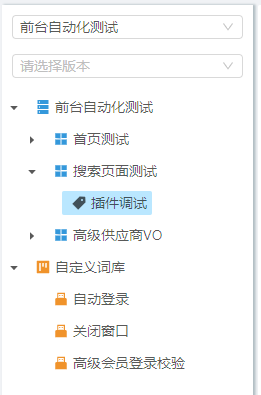
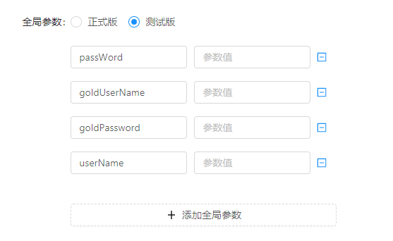
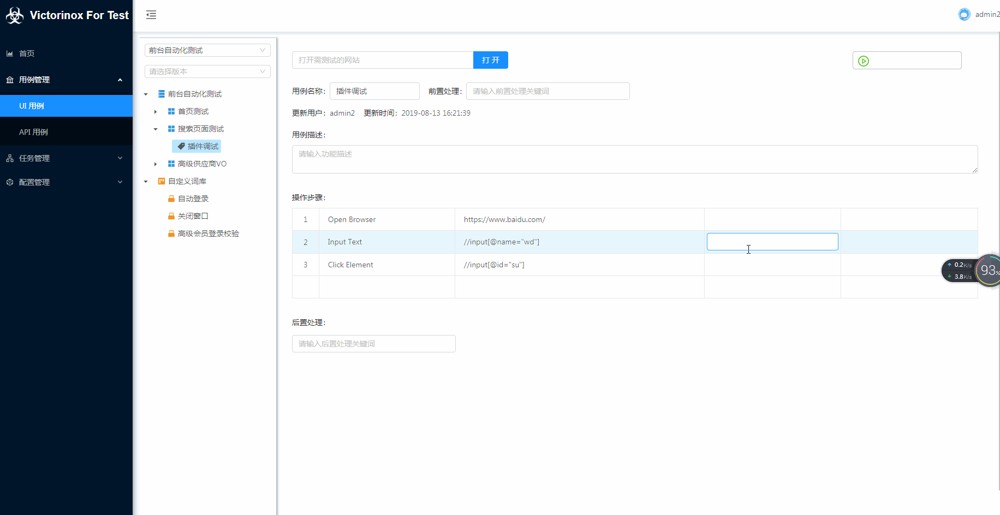
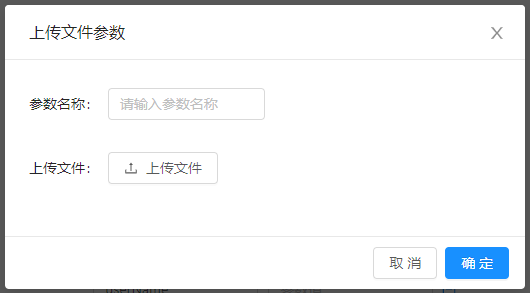
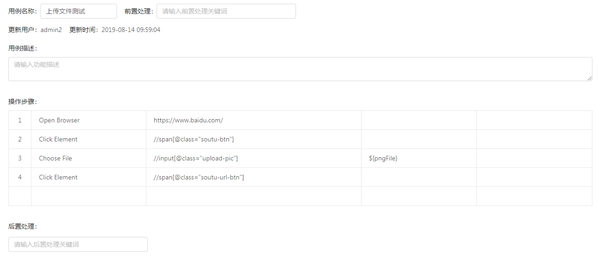

# WEB UI自动化用例

## 用例树结构

- 用例树分为3层，鼠标右键出操作菜单：项目、测试集、测试用例
- 默认会有该项目的一个自定义关键词库，可以直接在用例中自动联想
- **项目**：可以设置全局参数设置
- **测试集**：这里有一点要注意，测试用例中库关键词的搜索联想，是根据这里设置了库来的。比如：这里我指定了seleniumLibrary，用例才会联想到click xxxx关键词。
- **测试用例**：用例是业务的最小单元，可以设置关键词的前置、后置处理。语法上和Robotframework没有区别。
- **自定义关键词**：可以理解为RF中Keyword，支持入参和返回值。

## 项目全局参数设置
### 全局参数

{.img-fluid tag=1}

全局参数在当前项目下，用例编辑中可以自动联想搜索。

这里可以看到参数分为2个类型：正式版、测试版

{.img-fluid tag=2}

### 全局文件参数

测试流程中，上传图片是我们常见需求。这里我们通过上传测试文件到服务端，在生成用例时把服务端的文件路径写入全局参数中，通过“**Choose File**”关键词使用。

{.img-fluid tag=3}

用例示范：
{.img-fluid tag=4}

## 新建测试集

右键项目节点，可以为其新建测试集。 

右键测试集，可对其进行删除等操作。 

> 测试集有用例时，无法直接删除。

## 新建用例

右键测试集，可以为其生成测试用例。 
右键测试用例，可对其进行删除等操作。 

> 同一个测试集的测试用例，最终会生成一个xxx.robot的测试文件。 建议分清业务模块，不要集中在一个测试集里。
